# Operators

Java provides a rich operators environment. Most of its operator can be divided in the following groups:


## Operator Precedence

The following table shows the order of precedence for java operators, from highest to lowest.


## Unary Operators


In this group there are the ***increments*** (**++**) and ***decrements*** (**--**) operators.


### Increment and Decrement Operator

The **++** and **--** are Java's increment and decrement operators. The increment operator increase its operand by one. The decrement operator decrease its operand by one. For example:

```java
// Increment statement
x = x + 1;

// Can be rewritten like this by use of the increment operator
x++;

// Decrement statement
x = x - 1;

// is equivalent to
x--;
```

These operators are unique and they can appear both in ***postfix form***, where they follow the operand, and ***prefix form***, where they precede the operand.

#### Prefix form

The operand is incremented or decremented before the value is obtained for use in the expression.

```java
var parkAttendance = 0;

System.out.println(parkAttendance); // 0
System.out.println(++parkAttendance); // 1
System.out.println(++parkAttendance); // 2
```

#### Postfix form

In this form, the previous value is obtained for use in the expression, and then the operand is modified.

```java
var parkAttendance = 2;

System.out.println(parkAttendance); // 2
System.out.println(parkAttendance--); // 2
System.out.println(parkAttendance--); // 1
System.out.println(parkAttendance); // 0
```

#### Increment and Decrement Demonstrate

```java
class BothIncDec {
    public static void main(String[] args) {
        var a = 1;
        var b = 2;
        var c = ++b;
        var d = a++;
        c++;

        System.out.println("a = " + a); // a = 2
        System.out.println("b = " + b); // b = 3
        System.out.println("c = " + c); // c = 4
        System.out.println("d = " + d); // d = 1
    }
}
```

```java
class PrecedencePostfixPrefix {
	public static void main(String[] args) {
        var lion = 3;
        var tiger = ++lion * 5 / lion--; // 3 * 5 / 3

        System.out.println("lion is " + lion); // lion is 3
        System.out.println("tiger is " + tiger); // tiger is 5
    }
}
```


## Binary Arithmetic Operators

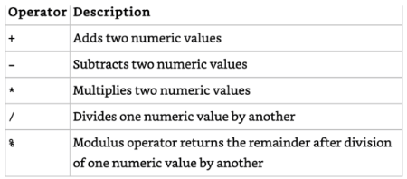

Examples:

```java
class BinaryArithmeticOperators {
    public static void main(String[] args) {
        // Operator precedence
        var price = 2 * 5 + 3 * 4 - 8;
        System.out.println("The price is " + price); // The price is 14

        // Parentheses raise the precedence of the operations that are inside them.
        var amount = 2 * ((5 + 3) * 4 - 8);
        System.out.println("The amount is " + amount); // The amount is 48
    }
}
```


## Numeric Promotion

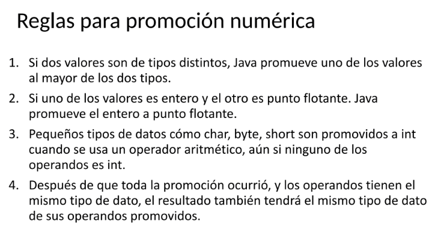

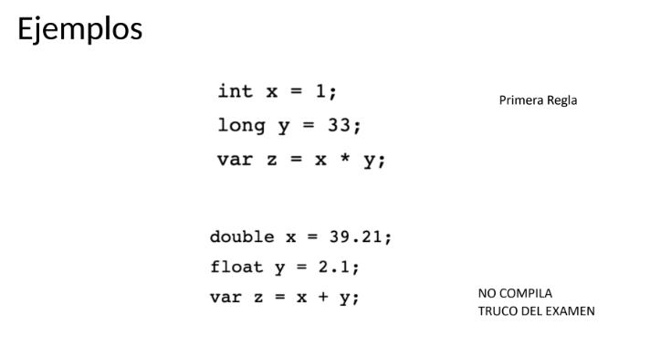

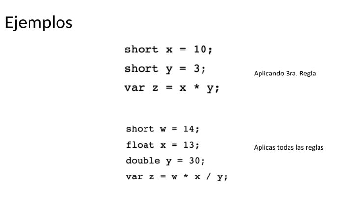


## Casting

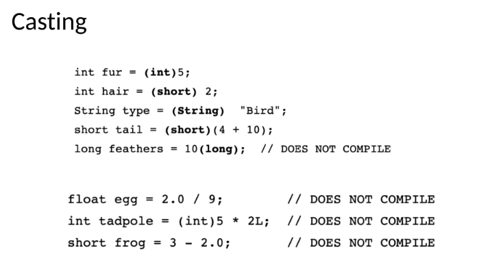


## Primitive assignment - Overflow and Underflow

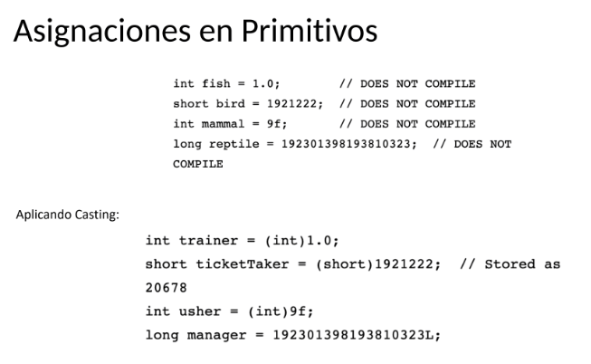

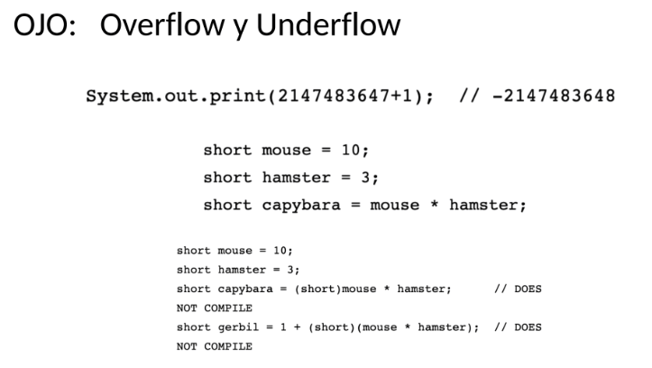


## += and -= Operators

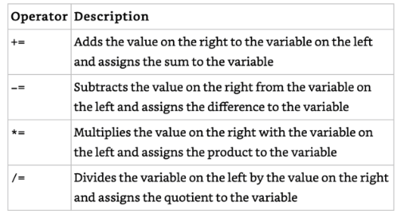

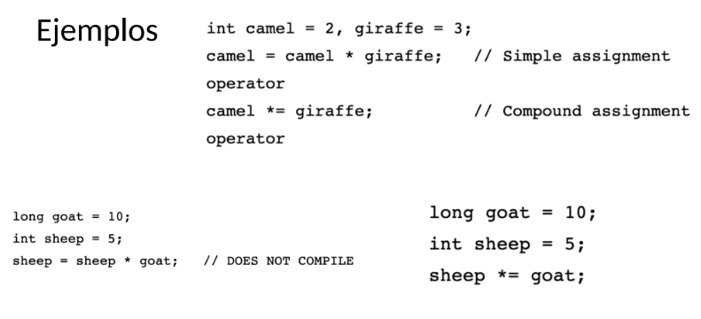


## Equality operators

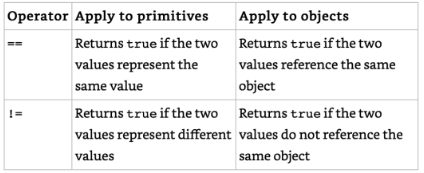

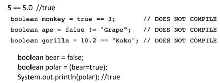

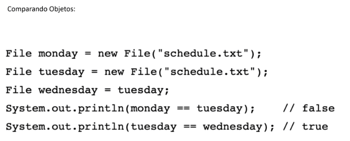

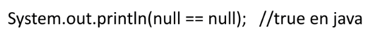


## Relational Operators

The relational operators determine the relationship that one operand has to the
other. Specifically, they determine equality and ordering.

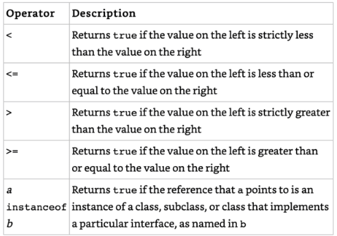

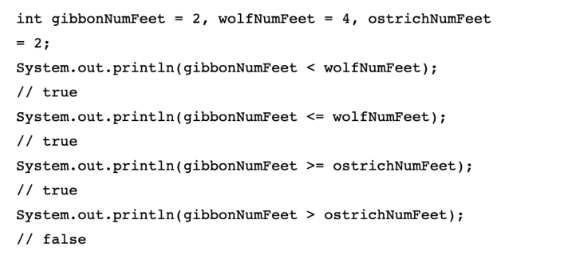


```java
public class InstanceofDemo {
    public static void main(String[] args) {
        Integer zooTime = Integer.valueOf(9);

        Number num = zooTime;
        Object obj = zooTime;

        openZoo(zooTime); // 9 O'clock
        openZoo(num); // 9 O'clock
		// openZoo(obj); Does not compile
        openZoo((Number) obj); // 9 O'clock
    }

    public static void openZoo(Number time) {
        if (time instanceof Integer)
            System.out.println((Integer)time + " O'clock");
        else
            System.out.println(time);
    }

    // Not compile
    public static void openZooFail(Number time) {
        if (time instanceof String) // Does not compile
            System.out.println((Integer)time + "O'clock");
        else
            System.out.println(time);
    }
}
```

```java
System.out.println(null instanceof Object); // false

Object noObjectHere = null;
System.out.println(noObjectHere instanceof String); // false

System.out.println(null instanceof null); // Does not compile
```


## Logical Operators

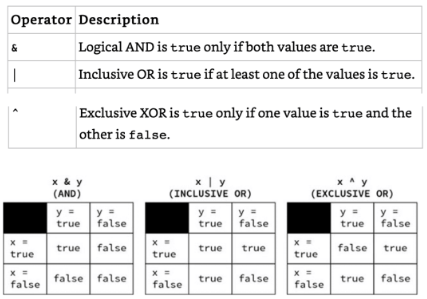

Let's take a look at some examples:

```java
boolean eyesClosed = true;
boolean breathingSlowly = true;
boolean resting = eyesClosed | breathingSlowly;
boolean asleep = eyesClosed & breathingSlowly;
boolean awake = eyesClosed ^ breathingSlowly;

System.out.println(resting); // true
System.out.println(asleep); // true
System.out.println(awake); // false
```


## Short Circuit Logical Operators

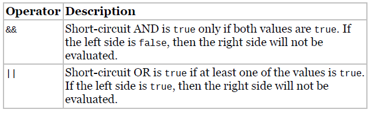

The ***short-circuit operators*** are nearly identical to the logical operators, & and |, except that the right side of the expression may never be evaluated if the final result can be determined by the left side
of the expression.

Example:

```java
int hour = 10;
boolean zooOpen = true || (hour < 4); // The right side is not evaluated
System.out.println(zooOpen); // true
```

Referring to the truth tables, the value ***zooOpen*** can be false only if both sides of the expression are false. Since we know the left side is true, there’s no need to evaluate the right side.

### Avoiding a NullPointerException

A more common example of where short-circuit operators are used is checking for null objects before performing an operation. In the following example, if duck is null, then the program will throw a ***NullPointerException*** at runtime:

```java
if (duck != null & duck.getAge() < 5) { // Could throw a NullPointerException
    // Do something
}
```

The issue is that the **logical** **AND (&)** operator evaluates both sides of the expression. We could add a second if statement, but this could get unwieldy if we have a lot of variables to check. An easy-to-read solution is to use the **short-circuit AND operator (&&)**:

```java
if (duck != null && duck.getAge() < 5) {
    // Do something
}
```

In this example, if duck was null, then the short-circuit prevents a **NullPointerException** from ever being thrown, since the evaluation of *duck.getAge() < 5* is never reached.


## Ternary Operator

The conditional operator, **? :**, otherwise known as the ***ternary operator***. It is notable in that it is the only operator that takes three operands. The ***ternary operator*** has the following form:

> booleanExpression ? expression1 : expression2

The first operand must be a *boolean expression*, and the second and third operands can be any expression that returns a value. The ternary operation is really a condensed form of a combined **if** and **else** statement that returns a value.

```java
int owl = 5;
int food;
if(owl < 2) {
	food = 3;
} else {
	food = 4;
}
System.out.println(food); // 4
```

```java
int owl = 5;
int food = owl < 2 ? 3 : 4;
System.out.println(food); // 4
```

```java
int stripes = 7;
System.out.print((stripes > 5) ? 21 : "Zebra");
int animal = (stripes < 9) ? 3 : "Horse"; // DOES NOT COMPILE
```

